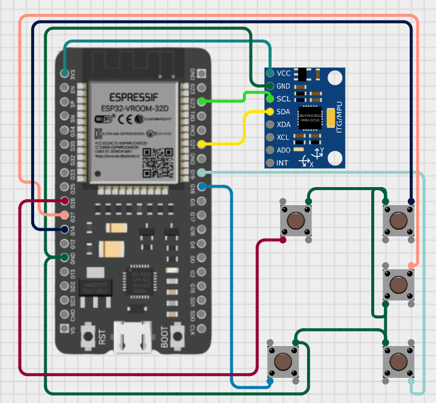

# 🖱️ AirMouse using ESP32

The **AirMouse ESP32** project transforms your ESP32 into a **wireless air mouse**, where motion is detected using sensors and translated into mouse movements via Bluetooth.  
It’s perfect for presentations, robotics control, or experimenting with wearable tech.

---

## 📂 Files in this Project
- **AirMouseesp32.ino** → Main source code to upload on the ESP32.  
- **schematics.png** → Circuit diagram for connections.  
- **Required_Libraries/** → Contains all necessary libraries to compile the project.  

---

## 🔌 Circuit Schematic
<p align="center">
  
</p>

---

## ⚡ ESP32 Board Setup

To program the ESP32 in the Arduino IDE, you need to add the ESP32 board support.  

1. Open **Arduino IDE** → File → Preferences.  
2. In **Additional Board Manager URLs**, paste:  

 ```text
   https://raw.githubusercontent.com/espressif/arduino-esp32/gh-pages/package_esp32_index.json
```

3. Go to **Tools → Board → Board Manager**.  
4. Search for **ESP32** and install the board.  

> ⚠️ **Important:** This project only works with **ESP32 Arduino Core v2.0.17**.  
Make sure to install **exactly this version** for successful flashing.  

---

## 📦 Required Libraries

The folder **Required_Libraries/** includes all the libraries needed.  
Typical dependencies:  

- **BleMouse** (for Bluetooth HID mouse functions)  
- **Adafruit MPU6050** (for motion sensing)  
- **Adafruit Sensor** (sensor abstraction)  
- **Wire** (I²C communication - installed auto with ide installation)
- **Adafruit BusIO** (for sensor)  

---

## 📚 How to Install Libraries

1. Open Arduino IDE.  
2. Go to **Sketch → Include Library → Add .ZIP Library**.  
3. Select the library ZIP files from the **Required_Libraries/** folder.  
4. Repeat for each library.  

After installation, restart the Arduino IDE to ensure everything is recognized.  

---

## 🛠️ Uploading the Code

1. Connect your ESP32 to your computer.  
2. Select the correct board:  
- **Tools → Board → ESP32 Arduino → ESP32 Dev Module**  
- Set proper **Port**.  
3. Make sure you’re using **ESP32 v2.0.17 core**.  
4. Open `AirMouseesp32.ino` and click **Upload**.  

---

## 🎯 Features
- Use ESP32 as a **Bluetooth Air Mouse**.  
- Motion detection using **MPU6050** accelerometer & gyroscope.  
- Simple schematic and wiring for easy setup.  
- Extendable for gesture control and robotics.  

---

## 🌍 Portfolio
Explore more of my work:  
- 📷 [Instagram](https://instagram.com/realmagix_)  
- 🌐 [Portfolio](https://technomaxxa.github.io)  

---

## 📜 License
This project is licensed under the **MIT License**.  
Free to use, modify, and share with attribution.  

---

> ⚡ *“Turning motion into interaction — the AirMouse ESP32 bridges the gap between hardware and human input.”*


